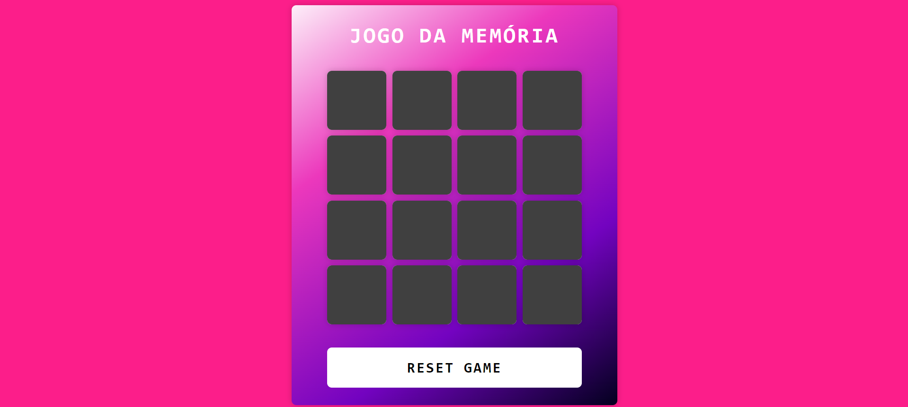

<h1>
  
  Jogo da Memória com Emojis
</h1>

Jogo da memória desenvolvido para praticar os conhecimentos adquidos no bootcamp da DIO em parceria com a Ri Happy.

#  Introdução 🔥
Os usuários são capazes de:
- Clicar para revelar os emojis
- Verifica se as peças são pares
- Caso os emojis não serem iguais são ocultados
- Formado todos os pares de emojis, aparece mensagem de vitória
- Botão para reiniciar, ocultar e embaralhar os emojis

## Link do Jogo 🔗
- *[Link do projeto](https://jogo-da-memoria-bootcamp-dio.vercel.app/)*
- *[Link do repositório do GitHub](https://github.com/tatyanepgoncalves/jogo-da-memoria)*

## Tecnologias usadas: 📦
- HTML
- CSS
- JavaScript 

##  Autores 👷

- **Tatyane Gonçalve** - *Desenvolvedora* - [@tatyanepgoncalves](https://github.com/tatyanepgoncalves)
- **Felipe Aguiar** - *Criador do Projeto e Tech Edutor* - [@felipeAguiarCode](https://github.com/felipeAguiarCode)